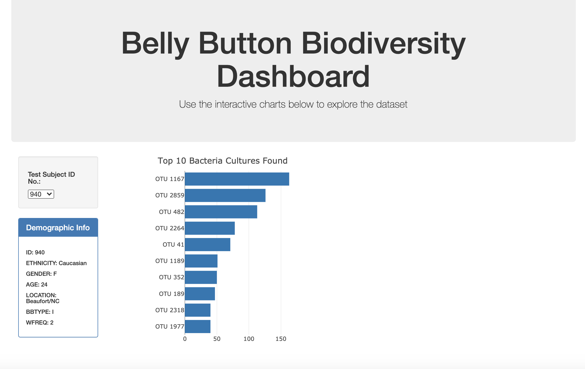
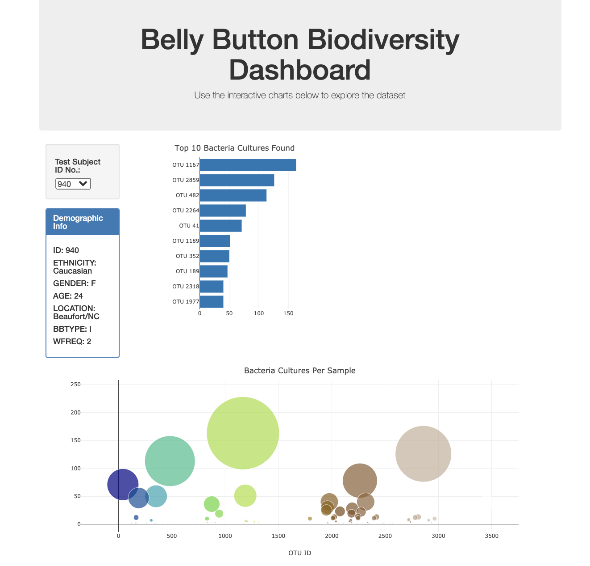

# Detailed Instructions From Your Instructor Team

The objective of this challenge is for you to add a horizontal bar chart that will display the top ten bacterial species found in a volunteer's navel, a bubble chart that will visualize the relative frequency of all the bacterial species found in the naval, and a gauge chart that will show the weekly naval washing frequency when an ID number is selected from the dropdown menu on a customized webpage.

## Deliverable 1: Create a Horizontal Bar Chart
For the first deliverable, we are asking you to create a horizontal bar chart that will display the top 10 bacterial species (OTUs) when an individual’s ID is selected from the dropdown menu webpage.  The horizontal bar chart will display the `sample_values` as the values, the `otu_ids` as the labels, and the `otu_labels` as the hover text for the bar chart.  

You might find this task slightly challenging. The steps to create the bar chart are similar to those that are covered in this module. We have provided the [bar chart starter code](./Resources/BellyButton_bar_chart_starter_code.js) to assist them.  

Before working on the starter code, you'll need to add to your GitHub pages folder, and rename the stater code file, `charts.js`. In addition, we have provided the [index.html](./Resources/index.html) file that has the chart "ids" you'll need to use to add all the plots.

In the bar chart starter code, we have provided the `buildCharts()` function that you can use to create the horizontal bar chart. 

  * In Steps 3-6, you'll need to initialize variables that hold arrays for the sample that is selected from the dropdown menu on the webpage.
  
  * Before you create the `trace` object, you'll need to create the `yticks` for the bar chart. In this step, you'll need to use the `slice()` method, and `map()` and `reverse()` functions to get the top 10 OTUs IDs in descending order.

  * For the `trace` object you'll need to add the `yticks` for the y-values, and you'll need to use the `slice()` method and `reverse()` functions to plot the x-values and add the text to the chart.

  * Finally, you'll need to use the `Plotly.newPlot()` function to plot the trace object with the layout.

your webpage should look like this image when it loads for the first time. 

## Deliverable 2: Create a Bubble Chart 
For this deliverable, we are asking you to create a bubble bar chart that will visualize the relative frequency of all the bacterial species found when an individual’s ID is selected from the dropdown menu webpage.  The bubble chart will display the following:
* The `otu_ids` as the x-axis values.
* The `sample_values` as the y-axis values. 
* The `sample_values` as the marker size.
* The `otu_ids` for as the marker colors.
* The `otu_labels` as the hover text values.

Creating a bubble chart is not taught in this module, so you might find this task challenging.  The main steps are adding a new `trace` object and layout for the bubble chart. In the `trace` object and layout, you'll be using the same variables you created in Deliverable 1. 

To help you, we have provided a [bubble chart starter code](./Resources/BellyButton_bubble_chart_starter_code.js). You should copy Steps 1-3 in the bubble chart starter code and add theses steps to your `charts.js` file after Step 10 for Deliverable 1.

Inside the `buildCharts()` function that was added in Deliverable 1, you will need to do the following:

  * Use the variables that were created in Deliverable 1 to populate the bubble chart.

  * Next, you'll need to create a `trace` object. We have provided a link to documentation that should help them create a `trace` object for a bubble chart. For the `trace` object, you'll need to:
    * Assign the `otu_ids`, `sample_values`, and `otu_labels` to the x, y and text properties. 
    * Add the `mode` and `marker` properties, where the `mode="markers"` and the marker property is a dictionary that has `size: sample_values`, `color: otu_ids`, and `colorscale: "Earth"`.

  * To create the layout for a bubble chart, we have provided a link to documentation that will help them. For the layout, you'll need to add a title, a label for the x-axis, margins, and `hovermode` property. The `hovermode` should show the text of the bubble on the chart when you hover close to that bubble. 

  * Finally, you'll need to use the `Plotly.newPlot()` function to plot the trace object with the layout.

your webpage should look like this image when it loads for the first time. 

## Deliverable 3: Create a Gauge Chart 
For this deliverable, we are asking you to create a gauge chart that will display the weekly washing frequency's value and as a measure of the progress bar in the gauge chart from 0-10 when an individual’s ID is selected from the dropdown menu.

Creating a gauge chart is not taught in this module, so you might find this task challenging as well, so we have provided the [gauge chart starter code](./Resources/BellyButton_gauge_starter_code.js). you should copy Steps 1-5 in the gauge chart starter code and add it to your `charts.js` file after Step 3 for Deliverable 2.

Inside the `buildCharts()` function that was added in Deliverable 1, you will need to do the following:

  * In Steps 1-3, you'll need to initialize variables that hold arrays for the sample that is selected from the dropdown menu on the webpage.

  * Next, you'll need to create a `trace` object. We have provided a link to documentation and steps in a Hint callout that should help you create a `trace` object for a gauge chart. 

  * Then, you'll need to create the layout. If you need help let them know you can use the link to the documentation that we provided in the Hint callout. For the layout, you'll need to make sure that the size the gauge chart appropriately so it fits in `

` tag for the gauge `id`.

  * Finally, you'll need to use the `Plotly.newPlot()` function to plot the trace object with the layout.

your webpage should look like this image when it loads for the first time. 

## Deliveravble 4: Customize the Dashboard
For the last deliverable, we are asking you to customize your webpage with three attributes. We have provide a list of options for them to choose from.

In addtion to the three attributes, you'll need to make sure that when the webpage is loaded that ID 940’s data should be displayed and the three charts should be working according to the requirements. In addition, when a sample is selected from the dropdown menu the dashboard should display the data in the demographic panel and all three plots should be updated according to the requirements.

## Submission

Make sure you upload the following to your GitHub pages repository:

1. The updated `index.html`.
2. The `charts.js` file.
3. The `samples.json` file.
4. A README.md that describes the purpose of the repository.  Although there is no graded written analysis for this challenge, it is encouraged and good practice to add a brief description of your project.

## Grading Rubric

The [Belly Button Grading Rubric](./Resources/Module_12_Challenge_Grading_Rubric.pdf) is provided for you to use when grading you' submissions.
